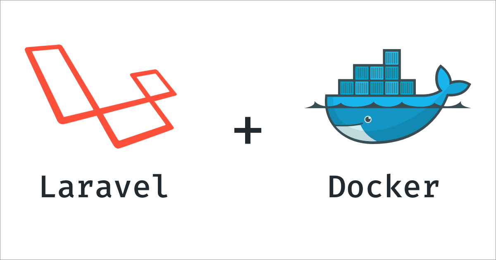

# Docker - Laravel


A pretty simplified Docker Compose workflow that sets up a LEMP (Linux, NGINX, MySQL, PHP) network of containers for local Laravel development.

## Ports

Ports used in the project:
| Software | Port |
|-------------- | -------------- |
| **nginx** | 80, 443 |
| **mysql** | 3306 |
| **php** | 9000 |
| **xdebug** | 9000 |
| **redis** | 6379 |

## Use

To get started, make sure you have [Docker installed](https://docs.docker.com/) on your system and [Docker Compose](https://docs.docker.com/compose/install/), and then clone this repository.

1. Clone this project:

   ```sh
   git clone https://github.com/anlamsky/docker-laravel.git
   ```
2. Inside the folder `docker-laravel` and Generate your own `.env` to docker compose with the next command:

   ```sh
   cp .env.example .env
   ```
3. Inside the folder `docker/nginx/conf.d` and Generate your own `app.conf` with the next command:

   ```sh
   cp app-pingpong.conf.example app.conf
   ```

4. You need **Create** or **Put** your laravel project in the folder source; 

5. Build the project whit the next commands:

   ```sh
   docker-compose up --build
   ```

---

## Remember

The configuration of the database **must be the same on both sides** .

```dotenv
# .env
DB_CONNECTION=mysql
DB_HOST=127.0.0.1
DB_PORT=3306
DB_DATABASE=db_name
DB_USERNAME=db_user
DB_PASSWORD=db_password
DB_ROOT_PASSWORD=secret
```

```dotenv
# source/.env
DB_CONNECTION=mysql
DB_HOST=mysql
DB_PORT=3306
DB_DATABASE=db_name
DB_USERNAME=db_user
DB_PASSWORD=db_password
```

The only change is the `DB_HOST` in the `source/.env` where is called to the container of `mysql`:

```dotenv
# source/.env
DB_HOST=mysql
```

---

A little help to create the project:

## Make a new Project

In the folder source

```sh
docker-compose run --rm composer create-project laravel/laravel .
```

---

### Install Libraries from Composer

```sh
docker-compose run --rm composer install
```

### Install Libraries from Node

```sh
docker-compose run --rm npm install
```

### Clear/Clean the project

```sh
docker-compose run --rm artisan clear:data
docker-compose run --rm artisan cache:clear
docker-compose run --rm artisan view:clear
docker-compose run --rm artisan route:clear
docker-compose run --rm artisan clear-compiled
docker-compose run --rm artisan config:cache
docker-compose run --rm artisan storage:link
```

### Generate Keys

```sh
docker-compose run --rm artisan key:generate
```

### Run migrations

```sh
docker-compose run --rm artisan migrate --seed
```

### Run Passport (Optional)

```sh
docker-compose run --rm artisan passport:install
```

---

## Special Cases

To Down and remove the volumes we use the next command:

```sh
docker-compose down -v
```

Update Composer:

```sh
docker-compose run --rm composer update
```

Run compiler (Webpack.mix.js) or Show the view compiler in node:

```sh
docker-compose run --rm npm run dev
```

Run all migrations:

```sh
docker-compose run --rm artisan migrate
```